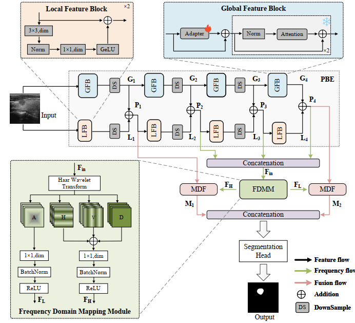

# LGFFM: A Localized and Globalized Frequency Fusion Model for Ultrasound Image Segmentation

[](https://ieeexplore.ieee.org/document/11129883)
[](https://www.python.org/)
[](./LICENSE)

📄 Published in **IEEE Transactions on Medical Imaging (TMI)**  
🔗 [Paper Link](https://ieeexplore.ieee.org/document/11129883)  

---

## 📖 Introduction



Accurate segmentation of ultrasound images plays a critical role in disease screening and diagnosis. Recently, neural network-based methods have shown great promise, but still face challenges due to the inherent characteristics of ultrasound images—such as **low resolution, speckle noise, and artifacts**.

Moreover, ultrasound segmentation spans a wide range of scenarios, including **organ segmentation** (e.g., cardiac, fetal head) and **lesion segmentation** (e.g., breast cancer, thyroid nodules), which makes the task highly diverse and complex. Existing methods are often tailored for specific cases, limiting their flexibility and generalization.

To address these challenges, we propose **LGFFM (Localized and Globalized Frequency Fusion Model)**, a novel framework for ultrasound image segmentation:

- **Parallel Bi-Encoder (PBE):** integrates Local Feature Blocks (LFB) and Global Feature Blocks (GLB) to enhance feature extraction.  
- **Frequency Domain Mapping Module (FDMM):** captures texture information, particularly high-frequency details like edges.  
- **Multi-Domain Fusion (MDF):** effectively integrates features across different domains for more robust segmentation.  

We evaluate LGFFM on **eight public ultrasound datasets across four categories**. Results show that LGFFM **outperforms state-of-the-art methods** in both segmentation accuracy and generalization performance.  

---

## 📂 Clone Repository

```bash
git clone https://github.com/Saillxl/LGFFM.git
cd LGFFM/
```

---

## 📑 Dataset Preparation

The dataset should follow the format below. 

```
**Example: BUSI dataset**
BUSI/
├─ img.yaml─ - /data/project/BUSI/img_dir/malignant (17).png
|            - /data/project/BUSI/img_dir/benign (42).png 
|            - /data/project/BUSI/img_dir/malignant (109).png
├─ ann.yaml─ - /data/project/BUSI/ann_dir/malignant (17).png
|            - /data/project/BUSI/ann_dir/benign (42).png 
|            - /data/project/BUSI/ann_dir/malignant (109).png 
```
⚠️Note: Masks are binary (0 and 1). The datasets used in the paper are as follows：

| Body Part   | Dataset    | Download Link                                                                                                 |
|-------------|------------|-----------------------------------------------------------------------------------------------------------------|
| Thyroid     | DDTI       | [Google Drive](https://drive.google.com/file/d/1wwlsEhwfSyvQsJBRjeDLhUjqZh8eaH2R/view)                        |
|             | TN3K       | [GitHub (Zhihu Redirect)](https://link.zhihu.com/?target=https%3A//github.com/haifangong/TRFE-Net-for-thyroid-nodule-segmentation) |
| Breast      | Dataset B  | [MMU Breast Ultrasound Dataset](https://helward.mmu.ac.uk/STAFF/m.yap/dataset.php)                           |
|             | BUSI       | [Cairo University Page](https://scholar.cu.edu.eg/?q=afahmy/pages/dataset)                                   |
| Cardiac     | CAMUS      | [Kaggle Dataset](https://www.kaggle.com/datasets/toygarr/camus-dataset?resource=download)                    |
|             | HMC-QU     | [Baidu AI Studio](https://aistudio.baidu.com/datasetdetail/102406)                                            |
| Fetal Head  | JNU-IFM    | [PS-FH-AOP 2023 Challenge](https://ps-fh-aop-2023.grand-challenge.org/)                                       |
|             | HC18       | [HC18 Challenge](https://hc18.grand-challenge.org/)                                                           |
---

## ⚙️ Requirements
We recommend creating a clean environment:

```
conda create -n LGFFM python=3.10
conda activate LGFFM
pip install -r requirements.txt
```

## 🚀 Training
1. Download pre-trained weights from the official (not 2.1) [SAM2 large repository](https://github.com/facebookresearch/sam2?tab=readme-ov-file). Place the weights in the "checkpoints" folder. If you want to place it elsewhere, modify the parameter hiera_path in train.py.
2. Run train.py
```
python train.py --hiera_path './checkpoints/sam2_hiera_large.pt' --train_image_path 'data/BUSI/train/img.yaml' --train_mask_path 'data/BUSI/train/ann.yaml' --save_path 'output/BUSI' 
```

## 🧪 Testing
Run test.py
```
python test.py --checkpoint 'output/BUSI/SAM2-UNet-70.pth' --test_image_path 'data/BUSI/test/img.yaml' --test_gt_path 'data/BUSI/test/ann.yaml' --save_path 'output/'
```

## 📌 Citation
If you find this repository useful, please cite our paper(bibtex):
```
@ARTICLE{11129883,
  author={Luo, Xiling and Wang, Yi and Ou-Yang, Le},
  journal={IEEE Transactions on Medical Imaging}, 
  title={LGFFM: A Localized and Globalized Frequency Fusion Model for Ultrasound Image Segmentation}, 
  year={2025},
  volume={},
  number={},
  pages={1-1},
  keywords={Image segmentation;Ultrasonic imaging;Feature extraction;Frequency-domain analysis;Transformers;Training;Lesions;Data mining;Image edge detection;Faces;Neural network;ultrasound image segmentation;parallel bi-encoder;multi-domain fusion},
  doi={10.1109/TMI.2025.3600327}}
```

## 🙏 Acknowledgement
[Segment Anything 2 (SAM2)](https://github.com/facebookresearch/sam2)

[SAM2UNet](https://github.com/WZH0120/SAM2-UNet)

Public ultrasound datasets (e.g., BUSI)
##
